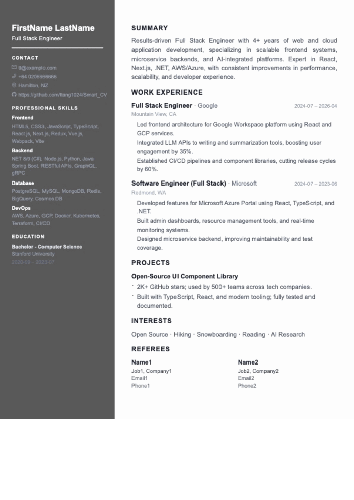

# SmartCV

AI-powered resume builder. Runs entirely in your browser — no account, no cloud storage, no data leaving your device.




## Features

- **AI tools** — job-description optimization with ATS match score, cover letter and follow-up email generation, proofreading, interview prep, and an interactive mock interviewer with voice dictation
- **ATS checker** — instant client-side resume audit, no AI key needed
- **Job versions** — fork your resume per role, track application status, and compare against the original
- **Translation** — translate the whole resume into another language as a new linked copy
- **9 resume styles** — plus a fully configurable Custom style and live theme colour
- **Import / export** — PDF import (incl. LinkedIn exports), pixel-perfect PDF export, client-side DOCX export, and [JSON Resume](https://jsonresume.org) interchange
- **Private share links** — read-only copy compressed into the URL fragment, with QR code
- **Fully private** — autosave to IndexedDB, undo/redo history; the only outbound traffic is your own AI API calls
- **Bring your own AI** — OpenAI, Claude, Gemini, Grok, DeepSeek, Qianwen, Kimi, Doubao, or Wenyanyixin

## Getting Started

**Prerequisites:** Node.js 20+, .NET SDK 10+

```bash
git clone https://github.com/ttang1024/Smart_CV.git && cd Smart_CV
cd SmartCV.API && dotnet run                          # backend → http://localhost:5167
cd SmartCV.Web && npm install && npm run dev          # frontend → http://localhost:3000 (second terminal)
```

Then add an API key for your preferred AI provider in **Settings**.

**Production build** (one .NET process serves the API and the SPA):

```bash
cd SmartCV.Web && npm run build
cd ../SmartCV.API && dotnet publish -c Release -o ./publish
./publish/SmartCV.API
```

## Tech Stack & Architecture

Next.js 16 (static export) + React 19 + TypeScript + Tailwind, with Zustand and IndexedDB for state. Backend is a .NET 10 Minimal API. i18n via i18next (en / es / zh-CN / zh-TW).

```
Browser (Next.js SSG)
  │  IndexedDB / localStorage — resumes, settings, history
  └─ /api ──► .NET 10 Minimal API
                  ├─ /api/ai/chat      — proxies to AI provider (avoids CORS, hides keys)
                  ├─ /api/pdf/parse    — extracts sections from uploaded PDFs (PdfPig)
                  └─ /api/pdf/generate — renders HTML to PDF (Puppeteer/Chromium)
```

See [`tech/`](tech/) for detailed module documentation.

## Deployment

Docker container on AWS App Runner (`ap-southeast-2`), built locally and pushed to Amazon ECR; infrastructure is declared in `aws/cloudformation.yml`. Requires Docker and AWS CLI v2 with permissions for ECR, CloudFormation, IAM, and App Runner.

```bash
./deploy.sh [tag]       # full deploy: ECR repo + image + CloudFormation stack
./deploy-app.sh [tag]   # app only: rebuild image and update the stack (faster)
```

## Contributing

Open an issue before submitting a large PR; small fixes can go straight to a PR. Run `npm run lint` in `SmartCV.Web` before opening a PR against `main`.

## License

[MIT](LICENSE)
