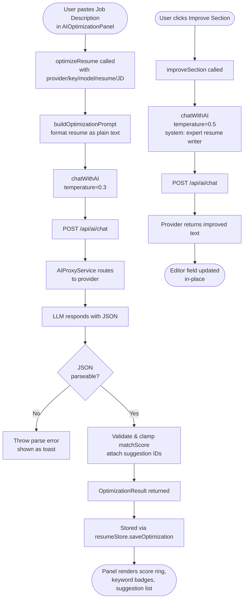

# AI Optimize Module

Analyses a resume against a job description using any configured LLM provider and returns an ATS match score, keyword gap analysis, and prioritised actionable suggestions. Also supports per-section text improvement.

---

## Flow Chart



---

## Front-End

### Components / Services

| File | Role |
|---|---|
| `SmartCV.Web/src/components/ai/AIOptimizationPanel.tsx` | Main optimization UI: JD input, score ring, suggestion list, apply buttons |
| `SmartCV.Web/src/components/ai/AIProviderSettings.tsx` | Provider selector, API key input, model picker |
| `SmartCV.Web/src/services/ai/aiService.ts` | `optimizeResume()`, `improveSection()`, `generateCoverLetter()`, `chatWithAI()` |
| `SmartCV.Web/src/store/resumeStore.ts` | `saveOptimization()`, `loadOptimizations()` — persists sessions to IndexedDB |
| `SmartCV.Web/src/types/ai.ts` | `OptimizationResult`, `OptimizationSuggestion`, `OptimizationSession` types |

### AIOptimizationPanel Props

```typescript
interface AIOptimizationPanelProps {
  resume: Resume;
  onApplySuggestion: (suggestion: OptimizationSuggestion) => void;
  onSessionSaved: (session: OptimizationSession) => void;
  // Shared job context (synced with CoverLetterPanel via EditorPage)
  jobContext?: { jobTitle: string; company: string; jobDescription: string };
  onJobContextChange?: (updates: Partial<{ jobTitle: string; company: string; jobDescription: string }>) => void;
}
```

The panel accepts `jobContext` and `onJobContextChange` so that `jobTitle`, `company`, and `jobDescription` are shared with the Cover Letter panel through the parent `EditorPage`.

### Optimization Prompt Construction

```typescript
// aiService.ts — buildOptimizationPrompt
export function buildOptimizationPrompt(resume: Resume, jobDescription: string): AIMessage[] {
  const resumeText = formatResumeAsText(resume);  // serialise to plain text

  return [
    {
      role: 'system',
      content: `You are an expert resume writer and career coach specializing in ATS optimization.
Analyze resumes against job descriptions and provide precise, actionable improvements.
Always respond with valid JSON only — no markdown, no extra text.`,
    },
    {
      role: 'user',
      content: `...
Return this exact JSON structure:
{
  "matchScore": <0-100 integer>,
  "summary": "<2-3 sentence analysis>",
  "keywordMatches": ["<keyword1>"],
  "missingKeywords": ["<keyword1>"],
  "suggestions": [
    {
      "type": "<summary|experience|skills|education|projects|general|keywords>",
      "priority": "<high|medium|low>",
      "section": "<specific section name>",
      "issue": "<what is wrong or missing>",
      "suggestion": "<specific actionable advice>",
      "originalText": "<original text if applicable, omit if not>",
      "improvedText": "<improved version if applicable, omit if not>"
    }
  ]
}`,
    },
  ];
}
```

### Optimize Resume Call

```typescript
// aiService.ts — optimizeResume
export async function optimizeResume(
  provider: AIProviderType, apiKey: string, model: string,
  resume: Resume, jobDescription: string,
): Promise<OptimizationResult> {
  const messages = buildOptimizationPrompt(resume, jobDescription);
  const content = await chatWithAI({ provider, apiKey, model, messages, temperature: 0.3 });

  // Robust JSON extraction: strip any prose the model wrapped around the JSON block
  const jsonMatch = content.match(/\{[\s\S]*\}/);
  if (!jsonMatch) throw new Error('No JSON found in response');
  const parsed = JSON.parse(jsonMatch[0]);

  return {
    matchScore: Math.min(100, Math.max(0, parsed.matchScore ?? 0)),
    summary: parsed.summary ?? '',
    keywordMatches: parsed.keywordMatches ?? [],
    missingKeywords: parsed.missingKeywords ?? [],
    suggestions: (parsed.suggestions ?? []).map((s, i) => ({
      ...s,
      id: `suggestion-${i}-${Date.now()}`,
      applied: false,
    })),
  };
}
```

### Section Improvement Call

```typescript
// aiService.ts — improveSection
export async function improveSection(
  provider: AIProviderType, apiKey: string, model: string,
  sectionType: string, currentContent: string,
  jobDescription: string, instruction: string,
): Promise<string> {
  const messages: AIMessage[] = [
    {
      role: 'system',
      content: 'You are an expert resume writer. Improve the provided resume section based on the job description and instructions. Return ONLY the improved text, no explanations.',
    },
    {
      role: 'user',
      content: `Section Type: ${sectionType}\nCurrent Content:\n${currentContent}\n\nJob Description:\n${jobDescription}\n\nInstruction: ${instruction}\n\nReturn only the improved text:`,
    },
  ];
  return chatWithAI({ provider, apiKey, model, messages, temperature: 0.5 });
}
```

### chatWithAI — Error Handling

`chatWithAI` throws a descriptive `Error` when the proxy returns a non-2xx status, surfacing the provider's error message from the response body:

```typescript
// aiService.ts — chatWithAI
export async function chatWithAI(request: ChatRequest): Promise<string> {
  const response = await fetch(`${API_BASE}/ai/chat`, { ... });

  if (!response.ok) {
    // parse provider error out of the problem-details body
    throw new Error(errorMessage);
  }

  const data = await response.json();
  return data.content as string;
}
```

### Resume Text Serialisation

Before sending to the LLM the resume is converted to plain text so every token counts toward resume content, not JSON syntax:

```typescript
// aiService.ts — formatResumeAsText (excerpt)
function formatResumeAsText(resume: Resume): string {
  const lines: string[] = [];
  lines.push(`Name: ${personalInfo.fullName}`);
  // ... experience, education, skills, projects, certifications, languages
  experience.forEach(exp => {
    lines.push(`${exp.position} at ${exp.company} (${exp.startDate} - ${exp.current ? 'Present' : exp.endDate})`);
    if (exp.description) lines.push(richTextToPlainText(exp.description));
    exp.highlights.forEach(h => lines.push(`• ${richTextToPlainText(h)}`));
  });
  return lines.join('\n');
}
```

`richTextToPlainText()` (`src/lib/richText.ts`) strips HTML/markdown from rich-text editor fields before sending to the AI.

---

## Back-End

The AI Optimize module has **no dedicated back-end logic** — it relies entirely on `AIProxyService` which is documented in [ai-proxy.md](ai-proxy.md).

The back-end simply forwards the structured prompt to the selected LLM provider and returns the raw content string. All prompt engineering, JSON parsing, and result shaping happens on the client.

---

## Data Types

```typescript
// types/ai.ts
interface OptimizationResult {
  matchScore: number;                    // 0-100
  summary: string;
  keywordMatches: string[];
  missingKeywords: string[];
  suggestions: OptimizationSuggestion[];
}

interface OptimizationSuggestion {
  id: string;
  type: 'summary' | 'experience' | 'skills' | 'education' | 'projects' | 'general' | 'keywords';
  priority: 'high' | 'medium' | 'low';
  section: string;
  issue: string;
  suggestion: string;
  originalText?: string;
  improvedText?: string;
  applied: boolean;
}

interface OptimizationSession {
  id: string;
  resumeId: string;
  createdAt: string;
  jobDescription: string;
  result: OptimizationResult;
}
```

---

## Optimization Session Persistence

Sessions are stored in the `optimizations` IndexedDB object store (see [storage.md](storage.md)) indexed by `resumeId` so the panel can show history per resume.

```typescript
// resumeStore.ts
saveOptimization: async (session: OptimizationSession) => {
  await optimizationDB.save(session);
  set(state => {
    const exists = state.optimizations.find(o => o.id === session.id);
    return {
      optimizations: exists
        ? state.optimizations.map(o => o.id === session.id ? session : o)
        : [session, ...state.optimizations],
      currentOptimization: session
    };
  });
},
```

---

## Temperature Strategy

| Use case | Temperature | Reason |
|---|---|---|
| ATS analysis / score | 0.3 | Deterministic JSON; low creativity needed |
| Section improvement | 0.5 | Some creative rewriting desired, but stay grounded |
| Cover letter generation | 0.55 | Natural prose with some variation |
| AI PDF parsing | 0.1 | Structured extraction — minimal randomness |
