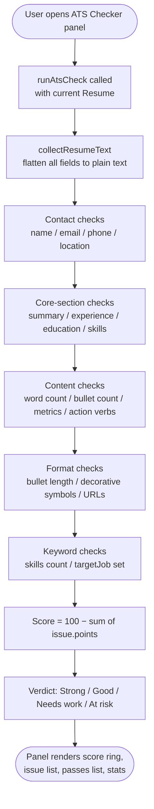

# ATS Checker Module

Static, client-side analysis that scores a resume against ATS readability criteria — no AI call required. Produces a 0–100 score, a verdict, and a ranked list of issues with actionable fixes.

---

## Flow Chart



---

## Front-End

### Components / Services

| File | Role |
|---|---|
| `SmartCV.Web/src/components/ats/ATSCheckerPanel.tsx` | UI: score ring, issue list, passed checks, stats |
| `SmartCV.Web/src/services/ats/atsChecker.ts` | Pure function `runAtsCheck(resume)` — no async, no AI |

### Running the Check

`runAtsCheck` is a synchronous pure function — it can be called on every resume change with no performance concern.

```typescript
// atsChecker.ts
export function runAtsCheck(resume: Resume): AtsCheckResult { ... }
```

---

## Check Categories

| Category | Checks |
|---|---|
| `contact` | Full name present; valid email; phone with digits; location filled |
| `sections` | Summary, experience, education, and skills all contain content |
| `content` | Summary 30–95 words; ≥ 3 bullets per role; ≥ 35 % bullets have metrics; ≥ 50 % bullets start with action verbs; long bullets (> 32 words); total word count 250–950 |
| `keywords` | ≥ 8 skills listed; `targetJob` field set |
| `format` | No decorative symbols (★☆◆…); all URLs match standard pattern; ≥ 4 sections populated |

---

## Scoring

Each issue carries a `points` penalty deducted from 100:

| Severity | Example | Typical points |
|---|---|---|
| `critical` | Missing name / email / core section | 10–12 |
| `warning` | Low metric ratio, thin skills, short resume | 4–8 |
| `info` | Long bullets, decorative symbols, no target job | 2–4 |
| `pass` | Informational only — no penalty | 0 |

```
score = max(0, min(100, 100 − Σ issue.points))
```

| Score | Verdict |
|---|---|
| ≥ 85 | Strong |
| ≥ 70 | Good |
| ≥ 50 | Needs work |
| < 50 | At risk |

---

## Data Types

```typescript
// atsChecker.ts
export type AtsIssueSeverity = 'critical' | 'warning' | 'info' | 'pass';
export type AtsIssueCategory = 'content' | 'keywords' | 'format' | 'sections' | 'contact';

export interface AtsIssue {
  id: string;
  severity: AtsIssueSeverity;
  category: AtsIssueCategory;
  title: string;
  detail: string;
  fix: string;
  points: number;
}

export interface AtsCheckResult {
  score: number;
  verdict: 'Strong' | 'Good' | 'Needs work' | 'At risk';
  summary: string;
  issues: AtsIssue[];     // ordered: critical → warning → info
  passed: AtsIssue[];     // checks that passed (severity = 'pass')
  stats: {
    wordCount: number;
    bulletCount: number;
    quantifiedBulletCount: number;
    actionVerbBulletCount: number;
    sectionCount: number;
    missingCoreSections: string[];
  };
}
```

---

## Action Verbs Dictionary

The checker recognises 30 strong verbs for bullet-start detection:

```
achieved, architected, automated, built, coached, created, delivered,
designed, developed, directed, drove, enabled, engineered, established,
expanded, implemented, improved, increased, launched, led, managed,
migrated, optimized, owned, reduced, resolved, scaled, shipped,
streamlined, transformed
```

---

## Key Implementation Notes

- `collectResumeText` flattens all resume fields into a single string for word-count and symbol detection.
- `richTextToPlainText` strips HTML from rich-text fields before analysis.
- Issues are returned sorted by severity priority then point value (highest-impact first).
- The check has **no back-end dependency** — it runs entirely in the browser.
