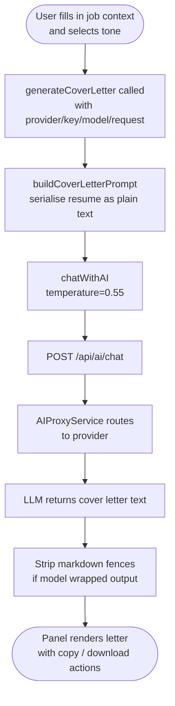

# Cover Letter Module

Generates a tailored cover letter from the current resume and a job description using any configured LLM provider. Output is plain text ready to copy or download.

---

## Flow Chart



---

## Front-End

### Components / Services

| File | Role |
|---|---|
| `SmartCV.Web/src/components/cover/CoverLetterPanel.tsx` | UI: job context inputs, tone selector, generated letter, copy/download |
| `SmartCV.Web/src/services/ai/aiService.ts` | `generateCoverLetter()`, `buildCoverLetterPrompt()` |

### Panel Props

```typescript
interface CoverLetterPanelProps {
  resume: Resume;
  // Shared job context (synced with AIOptimizationPanel via EditorPage)
  jobContext?: { jobTitle: string; company: string; jobDescription: string };
  onJobContextChange?: (updates: Partial<{ jobTitle: string; company: string; jobDescription: string }>) => void;
}
```

### Tone Options

| Value | Label |
|---|---|
| `professional` | Professional (default) |
| `warm` | Warm |
| `confident` | Confident |
| `concise` | Concise |

---

## Prompt Construction

```typescript
// aiService.ts — buildCoverLetterPrompt
export function buildCoverLetterPrompt({
  resume, jobDescription, jobTitle, company, hiringManager, tone = 'professional'
}: CoverLetterRequest): AIMessage[] {
  return [
    {
      role: 'system',
      content: `You are an expert career writer. Write tailored cover letters that are specific, credible, concise, and grounded only in the provided resume and job description.
Do not invent employers, credentials, degrees, metrics, or personal details.
Return only the finished cover letter text. Do not include markdown, explanations, placeholders, or analysis.`,
    },
    {
      role: 'user',
      content: `Generate a matching cover letter...
Requirements:
- 250-380 words.
- Standard letter format: greeting, 3-4 paragraphs, sign-off.
- If the hiring manager is missing, use "Dear Hiring Manager,".
- Connect 2-3 strongest achievements to job requirements.
- Do not claim experience not supported by the resume.`,
    },
  ];
}
```

### Generate Call

```typescript
// aiService.ts — generateCoverLetter
export async function generateCoverLetter(
  provider: AIProviderType, apiKey: string, model: string,
  request: CoverLetterRequest,
): Promise<string> {
  const content = await chatWithAI({
    provider, apiKey, model,
    messages: buildCoverLetterPrompt(request),
    temperature: 0.55,
  });

  // Strip any markdown fences the model may have added
  return content
    .replace(/^```(?:text|markdown)?/i, '')
    .replace(/```$/i, '')
    .trim();
}
```

---

## Request Type

```typescript
// aiService.ts
export interface CoverLetterRequest {
  resume: Resume;
  jobDescription: string;
  jobTitle?: string;
  company?: string;
  hiringManager?: string;
  tone?: 'professional' | 'warm' | 'confident' | 'concise';
}
```

---

## Back-End

Cover letter generation has **no dedicated back-end logic** — it uses the same `POST /api/ai/chat` endpoint as AI Optimize. See [ai-proxy.md](ai-proxy.md).

---

## Temperature Strategy

| Use case | Temperature |
|---|---|
| Cover letter generation | 0.55 — natural prose, some variation, grounded |

---

## Shared Job Context

`EditorPage` maintains a single `jobContext` state object that is passed to both `AIOptimizationPanel` and `CoverLetterPanel`. Changes in either panel propagate back to the parent via `onJobContextChange`, so the user only needs to enter the job description once.
