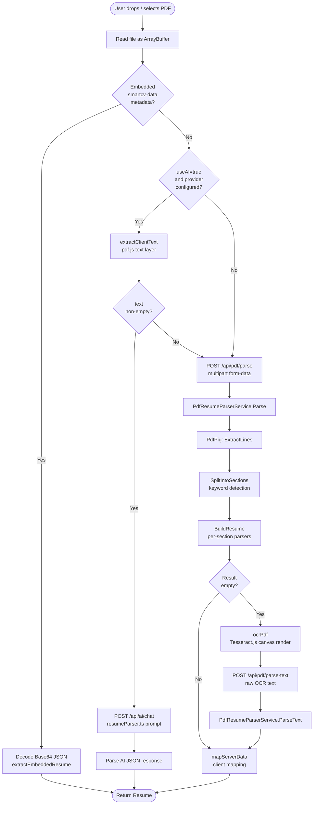

# PDF Parse Module

Converts an uploaded PDF resume into a structured `Resume` JSON object.  
Implements a four-stage fallback pipeline so that text PDFs, image PDFs, SmartCV re-imports, and AI-assisted imports are all handled.

---

## Flow Chart



---

## Front-End

### Components / Services

| File | Role |
|---|---|
| `SmartCV.Web/src/components/resume/PDFImport.tsx` | Drag-and-drop / file picker UI; orchestrates the pipeline |
| `SmartCV.Web/src/services/pdf/resumeParserApi.ts` | `parseResumeFromPdf()` — the four-stage pipeline |
| `SmartCV.Web/src/services/pdf/pdfParser.ts` | `extractTextFromPDF()` — client-side pdf.js extraction |
| `SmartCV.Web/src/services/ai/resumeParser.ts` | `parseResumeFromText()` — AI-assisted parsing via `chatWithAI` |

### Interaction Logic

1. User uploads a file → `PDFImport.tsx` calls `parseResumeFromPdf(file, { useAI })`.
2. The function reads the file as `ArrayBuffer` once and passes it through the four stages without re-reading the file.
3. On success the parsed `Resume` object is dispatched to `resumeStore.saveResume()` and the router navigates to the editor.
4. On failure an error toast is shown; no partial state is written.

### Stage 1 — Embedded metadata (lossless re-import)

When SmartCV exports a PDF it encodes the full resume JSON in the PDF's `Subject` metadata field as `smartcv-data:<base64>`.  
`extractEmbeddedResume()` checks for this prefix and short-circuits the rest of the pipeline.

```typescript
// resumeParserApi.ts
async function extractEmbeddedResume(arrayBuffer: ArrayBuffer): Promise<Resume | null> {
  const pdf = await pdfjsLib.getDocument({ data: arrayBuffer.slice(0) }).promise;
  const meta = await pdf.getMetadata();
  const subject = (meta.info as Record<string, string>).Subject ?? '';
  if (subject.startsWith('smartcv-data:')) {
    const json = decodeURIComponent(escape(atob(subject.slice('smartcv-data:'.length))));
    return JSON.parse(json) as Resume;
  }
  return null;
}
```

### Stage 2 — AI-assisted parsing

Uses `extractClientText()` (pdf.js text layer) to get plain text, then calls the AI proxy with a structured JSON prompt defined in `resumeParser.ts`.

```typescript
// resumeParserApi.ts — Stage 2
if (options?.useAI) {
  const aiConfig = useSettingsStore.getState().getActiveConfig();
  if (aiConfig) {
    const clientText = await extractClientText(arrayBuffer);
    if (clientText.trim()) {
      const { parseResumeFromText } = await import('../ai/resumeParser');
      return await parseResumeFromText(aiConfig.provider, aiConfig.apiKey, aiConfig.model, clientText, file.name);
    }
  }
}
```

### Stage 3 — Server-side PdfPig parse

```typescript
// resumeParserApi.ts — Stage 3
const form = new FormData();
form.append('file', file);
const response = await fetch(`${API_BASE}/pdf/parse`, { method: 'POST', body: form });
const data = await response.json();
if (!isResultEmpty(data)) return mapServerData(data, file.name);
```

### Stage 4 — Tesseract OCR fallback

For image-only PDFs (scanned resumes), each page is rendered to an off-screen `<canvas>` at 2× scale and passed to Tesseract.js, then the resulting text is sent to `/api/pdf/parse-text`.

```typescript
// resumeParserApi.ts — Stage 4 (ocrPdf)
const worker = await createWorker('eng');
for (let i = 1; i <= pdf.numPages; i++) {
  const page = await pdf.getPage(i);
  const viewport = page.getViewport({ scale: 2.0 });
  const canvas = document.createElement('canvas');
  canvas.width = viewport.width; canvas.height = viewport.height;
  await page.render({ canvas, canvasContext: canvas.getContext('2d')!, viewport }).promise;
  const { data: { text } } = await worker.recognize(canvas);
  allText.push(text);
}
await worker.terminate();
```

---

## Back-End

**File:** `SmartCV.API/Services/PdfResumeParserService.cs`  
**File:** `SmartCV.API/Models/ResumeModels.cs`

### API Endpoints

| Method | Path | Input | Output |
|---|---|---|---|
| `POST` | `/api/pdf/parse` | `multipart/form-data` with `file` field (PDF) | `ResumeParseResult` JSON |
| `POST` | `/api/pdf/parse-text` | `{ "text": "..." }` JSON | `ResumeParseResult` JSON |

Both endpoints are defined in `SmartCV.API/Program.cs`:

```csharp
// Program.cs
app.MapPost("/api/pdf/parse", async (HttpRequest request, PdfResumeParserService parser) =>
{
    var form = await request.ReadFormAsync();
    var file = form.Files.GetFile("file");
    await using var stream = file.OpenReadStream();
    var result = parser.Parse(stream);          // ← PdfResumeParserService.Parse
    return Results.Ok(result);
});

app.MapPost("/api/pdf/parse-text", (ParseTextRequest req, PdfResumeParserService parser) =>
{
    var result = parser.ParseText(req.Text);    // ← PdfResumeParserService.ParseText
    return Results.Ok(result);
});
```

### Three-Phase Parsing Pipeline

#### Phase 1 — Text Extraction (`ExtractLines`)

Uses **PdfPig** (`UglyToad.PdfPig`) to open the PDF stream and group words by their Y-coordinate bounding box into visual lines.  
A gap > 8 pt between consecutive word bounding boxes is treated as a column separator (inserted as `\t`).

```csharp
// PdfResumeParserService.cs — ExtractLines
private static List<string> ExtractLines(Stream pdfStream)
{
    using var document = PdfDocument.Open(pdfStream);
    foreach (var page in document.GetPages())
    {
        // SortedDictionary keyed by rounded Y (descending = top-first)
        var byY = new SortedDictionary<int, List<(double X, double Right, string Text)>>(
            Comparer<int>.Create((a, b) => b.CompareTo(a)));

        foreach (var word in page.GetWords())
        {
            var y = (int)Math.Round(word.BoundingBox.Bottom);
            byY.GetOrAdd(y).Add((word.BoundingBox.Left, word.BoundingBox.Right, word.Text));
        }

        foreach (var (_, words) in byY)
        {
            var ordered = words.OrderBy(w => w.X);
            // Gap > 8pt → tab (column boundary); otherwise space
            sb.Append(x - prevRight > 8.0 ? '\t' : ' ');
        }
    }
}
```

#### Phase 2 — Section Detection (`SplitIntoSections`)

Lines are classified into `SectionType` enum values (`Header`, `Summary`, `Experience`, `Education`, `Skills`, `Projects`, `Certifications`, `Languages`, `Interests`, `Referees`) by matching against a multilingual keyword dictionary.

Supported languages: **English**, **Spanish**, **Simplified Chinese**, **Traditional Chinese**.

```csharp
// PdfResumeParserService.cs — DetectSectionHeader (simplified)
private static SectionType? DetectSectionHeader(string line)
{
    var trimmed = line.Trim().TrimEnd(':', '：').Trim();
    // Strip CJK decoration brackets: 【工作经历】 → 工作经历
    trimmed = trimmed.Trim('【', '】', '《', '》').Trim();

    if (trimmed.Length > 60 || trimmed.Length < 2) return null;
    if (trimmed.All(c => c is '-' or '=' or '_')) return null;   // decorative separator

    var lower = trimmed.ToLowerInvariant();
    foreach (var (sectionType, keywords) in SectionKeywords)
        foreach (var kw in keywords)
            if (lower == kw || lower.StartsWith(kw + " ") || lower.StartsWith(kw + "/"))
                return sectionType;
    return null;
}
```

#### Phase 3 — Per-Section Parsers (`BuildResume`)

```csharp
// PdfResumeParserService.cs — BuildResume
private static ResumeParseResult BuildResume(Dictionary<SectionType, List<string>> sections)
{
    return new ResumeParseResult
    {
        PersonalInfo   = ParsePersonalInfo(sections[SectionType.Header]),
        Summary        = string.Join(" ", sections[SectionType.Summary].Where(...)),
        Experience     = ParseExperienceSection(sections[SectionType.Experience]),
        Education      = ParseEducationSection(sections[SectionType.Education]),
        Skills         = ParseSkillsSection(sections[SectionType.Skills]),
        Projects       = ParseProjectsSection(sections[SectionType.Projects]),
        Certifications = ParseCertificationsSection(sections[SectionType.Certifications]),
        Languages      = ParseLanguagesSection(sections[SectionType.Languages]),
        Interests      = ParseInterestsSection(sections[SectionType.Interests]),
        Referees       = ParseRefereesSection(sections[SectionType.Referees])
    };
}
```

### Personal Info Parser

Extracts contact fields using `[GeneratedRegex]` source-generated patterns:

```csharp
// PdfResumeParserService.cs — regex declarations
[GeneratedRegex(@"[\w.+\-]+@[\w\-]+\.[a-zA-Z]{2,}", RegexOptions.IgnoreCase)]
private static partial Regex EmailRx();

[GeneratedRegex(@"(\+?[\d][\d\s\-().]{6,}\d)", RegexOptions.IgnoreCase)]
private static partial Regex PhoneRx();

[GeneratedRegex(@"(?:linkedin\.com/in/|linkedin\.com/pub/)([\w\-]+)", RegexOptions.IgnoreCase)]
private static partial Regex LinkedInRx();

[GeneratedRegex(@"github\.com/([\w\-]+)", RegexOptions.IgnoreCase)]
private static partial Regex GitHubRx();
```

After contact lines are stripped, the first remaining line is the full name, the second is the job title or location.

### Experience & Education Entry Grouping

`GroupIntoEntries()` uses `DateRangeRx` to detect entry boundaries.  
`GroupEducationEntries()` additionally splits on `DegreeRx` appearing near the start of a line.

```csharp
// PdfResumeParserService.cs — GroupIntoEntries
private static List<List<string>> GroupIntoEntries(List<string> lines)
{
    // A new date-range line that is not a bullet starts a new entry,
    // unless the current entry has only one non-date header line
    // (e.g. PDF with right-aligned date on same visual row as company name).
    if (DateRangeRx().IsMatch(line) && !BulletRx().IsMatch(line) && current.Count > 0)
    {
        bool currentIsJustHeader = current.Count == 1
            && !DateRangeRx().IsMatch(current[0])
            && !DateRx().IsMatch(current[0]);
        if (!currentIsJustHeader) { entries.Add(current); current = []; }
    }
    current.Add(line);
}
```

### Date Normalization

All dates are normalized to `YYYY-MM` format. Supports English month names, Spanish month names, Chinese year-month format (`2024年3月`), `MM/YYYY`, and plain year.

```csharp
// PdfResumeParserService.cs — NormalizeDate
private static string NormalizeDate(string raw)
{
    // Chinese "YYYY年MM月" or "YYYY年"
    var zhDate = Regex.Match(raw, @"^(\d{4})年(?:(\d{1,2})月)?$");
    if (zhDate.Success)
        return $"{zhDate.Groups[1].Value}-{zhDate.Groups[2].Value.PadLeft(2, '0')}";
    // "Month YYYY"
    var moy = Regex.Match(raw, @"^([A-Za-z]+)\.?\s+(\d{4})$");
    if (moy.Success)
        return $"{moy.Groups[2].Value}-{MonthMap[moy.Groups[1].Value.ToLower()]}";
    // Plain year
    if (Regex.IsMatch(raw, @"^\d{4}$")) return $"{raw}-01";
    return raw;
}
```

### Data Model

```
ResumeParseResult
├── PersonalInfo  (FullName, Email, Phone, Location, Title, LinkedIn, GitHub, Website)
├── Summary       (string)
├── Experience[]  (Company, Position, Location, StartDate, EndDate, Current, Description, Highlights[])
├── Education[]   (Institution, Degree, Field, StartDate, EndDate, Current, Gpa, Honors)
├── Skills[]      (Category, Items[])
├── Projects[]    (Name, Description, Technologies[], Url, GitHub)
├── Certifications[] (Name, Issuer, Date, ExpiryDate, CredentialId)
├── Languages[]   (Language, Proficiency)
├── Interests[]   (string)
├── Achievements[] (Title, Issuer, Date, Description)
└── Referees[]    (Name, Title, Company, Email, Phone)
```

**Defined in:** `SmartCV.API/Models/ResumeModels.cs`

---

## Database Diagram (IndexedDB — client-side)

```
┌──────────────────────────────────┐
│  Object Store: resumes           │
│  keyPath: id (string UUID)       │
│  index: by-updated (updatedAt)   │
│                                  │
│  id          string              │
│  name        string              │
│  createdAt   ISO string          │
│  updatedAt   ISO string          │
│  personalInfo PersonalInfo       │
│  summary     string (rich text)  │
│  experience  Experience[]        │
│  education   Education[]         │
│  skills      Skill[]             │
│  projects    Project[]           │
│  ...         (full Resume type)  │
└──────────────────────────────────┘
```

See [storage.md](storage.md) for full IndexedDB schema.
